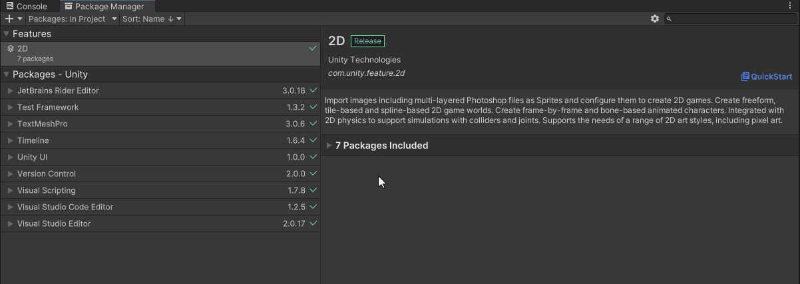

# Mizugo Client Unity
用於與 [Mizugo] 伺服器連線的 [Unity] 客戶端網路組件

# 系統需求
- [Unity] 2021.3.9f1+
- [Proto] v3

# 安裝說明
- 安裝 `Google Protobuf` 組件
    - 若專案中已包含 `Google Protobuf` 組件, 可略過此步驟
    - 方法一: 自行編譯
        - 安裝 [Visual Studio Community](https://visualstudio.microsoft.com/zh-hant/vs/community/)
        - 下載 [Google Protobuf](https://github.com/protocolbuffers/protobuf) 原始碼
        - 在 `Release` 區段找到所需版本(目前使用 `Protocol Buffers v21.12`), 下載並解壓縮 `protobuf-all-21.12.zip`
        - 開啟 `csharp/src/Google.Protobuf.sln`, 在 Visual Studio 中執行 `建置 > 批次建置`, 勾選 `Google.Protobuf` 的 Release 並建置
        - 若遇到任何問題, 需自行排除; 若有如下錯誤信息
          ```
          Detailed Information: Unable to locate the .NET Core SDK. Check that it is installed and that the version specified in global.json (if any) matches the installed version.
          ```
          這通常是 SDK 版本不符, 請使用 `dotnet --version` 檢查, 並調整 `global.json` 內的版本號
        - 成功編譯後, 檔案會出現在 `csharp/src/Google.Protobuf/bin/Release`, 依 [Unity] 需求(通常是 `net45`), 將相應 DLL 複製到 `Assets/Plugins`
    - 方法二: 從 Package Manager 安裝
        - 打開 [Unity] 的 Package Manager
        - 點擊左上角「+」, 選擇 `Add package from git URL...`
        - 輸入網址 `https://github.com/yinweli/Mizugo.git#proto-unity`
        - 點擊 add 按鈕, 等待安裝完成
- 安裝 `Newtonsoft JSON` 組件
    - 若專案中已包含 `Newtonsoft JSON` 組件, 可略過此步驟
    - 打開 [Unity] 的 Package Manager
    - 點擊左上角「+」, 選擇 `Add package by name...`
    - 輸入名稱 `com.unity.nuget.newtonsoft-json`
    - 點擊 add 按鈕, 等待安裝完成
- 安裝 `Mizugo Client Unity` 組件
    - 在 [Unity] 的 Package Manager 中點擊左上角的 + 號
    - 選擇 `Add package from git URL...`, 輸入安裝路徑
      ```
      https://github.com/yinweli/Mizugo.git#client-unity
      ```
    - 點擊 add 按鈕, 等待安裝完成



# 範例專案
- 最簡單的示範請參考 `Tests/Runtime/TestTCPClient.cs`
- 完整範例可參考 [Mizugo] 專案的 `client-unity-sample` 分支

# 專案說明
客戶端由四個核心組件組成:

- [網路組件](#網路組件)
- [事件組件](#事件組件)
- [訊息處理組件](#訊息處理組件)
- [編碼/解碼流程](#編碼解碼流程)

## 網路組件
負責連線、斷線、訊息傳送、事件處理, 以及編碼/解碼

需定時呼叫 `Update()` 來驅動事件與訊息處理

提供 `TCPClient` 來使用 TCP 連線到伺服器
```cs
var client = new TCPClient();
var eventmgr = new Eventmgr();
var process = new ProcJson();

client.SetEvent(eventmgr);
client.SetProc(process);
client.SetCodec(process, new DesCBC(PaddingMode.PKCS7, key, iv), new Base64()); // 設定編碼/解碼流程, 這裡設定了依序做ProcJson, desCBC, base64的編碼/解碼
client.SetPacketSize(1 * 1024 * 1024) // 設定封包長度上限

client.AddEvent(...);   // 註冊事件處理
client.AddProcess(...); // 註冊訊息處理
client.Connect(...);    // 連線
client.Update();        // 更新
client.Disconnect();    // 斷線
```

## 事件組件
處理網路事件, 避免使用者直接面對多執行緒

提供標準事件處理器 `Eventmgr`

## 訊息處理組件
負責處理實際訊息; 不同組件使用不同封包結構, 不能混用

提供以下組件:
- ProcJson: 使用 JSON 結構通訊, 訊息定義在
  - support/proto-mizugo/msg-go/msgs-json/json.go
  - support/proto-mizugo/msg-cs/msgs-json/Json.cs
- ProcProto: 使用 Proto 結構通訊, 訊息定義在
  - support/proto-mizugo/proto.proto
- ProcRaven: 使用 RavenS/RavenC 結構通訊, 訊息定義在
  - support/proto-mizugo/raven.proto

## 編碼/解碼流程
定義訊息在傳送與接收時的轉換, 需與伺服器設定一致

## 封包限制
最大封包長度為 65535 bytes (64KB)

## 事件
所有事件定義於 `EventID` 列舉

| 名稱       | 說明                                           |
|:-----------|:-----------------------------------------------|
| Connect    | 連線事件, 參數是null                           |
| Disconnect | 斷線事件, 參數是null                           |
| Recv       | 接收事件, 當接收並處理完封包後執行, 參數是null |
| Send       | 傳送事件, 當傳送封包完畢後執行, 參數是null     |
| Error      | 錯誤事件, 參數是Exception                      |

## 異常
除了 .NET 內建例外, 還有以下自訂異常

| 異常類型              | 異常名稱             | 說明                                                   |
|:----------------------|:---------------------|:-------------------------------------------------------|
| AlreadyStartException | '已經啟動'異常       | 已連線或連線中再次執行連線函式時                       |
| DisconnectException   | 中斷連線異常         | 斷線時發生                                             |
| PacketLimitException  | 封包長度超過上限異常 | 接收/傳送封包超過設定大小                              |
| PacketNullException   | 封包為空異常         | 接收/傳送流程遇到空指標                                |
| PacketZeroException   | 封包長度為零異常     | 接收/傳送到長度為 0 的封包                             |
| RecvHeaderException   | 接收標頭異常         | 標頭長度與預期不符                                     |
| RecvPacketException   | 接收封包異常         | 封包長度與預期不符                                     |
| UnprocessException    | 訊息未處理異常       | 發生在接收訊息但沒有對應的訊息處理函式時(可視情況忽略) |

> 除了 `UnprocessException`, 其他異常皆屬嚴重錯誤, 通常應中斷連線

此外, 若發生網路錯誤, 會丟出 `.NET SocketException`
可轉型為 `SocketException` 並檢查 `SocketErrorCode` 判斷原因, 內容可參考
- [Socket-Error-Enum]
- [Socket-Error-Code]

# 專案目錄說明
| 目錄               | 說明         |
|:-------------------|:-------------|
| Runtime/Clients    | 網路組件     |
| Runtime/Cryptos    | 加解密組件   |
| Runtime/Exceptions | 異常組件     |
| Runtime/Msgs       | 訊息組件     |
| Tests/Runtime      | 單元測試     |
| Tests/Runtime/Msgs | 測試訊息定義 |

[Mizugo]: https://github.com/yinweli/mizugo
[Proto]: https://github.com/protocolbuffers/protobuf
[Socket-Error-Code]: https://learn.microsoft.com/zh-tw/windows/win32/winsock/windows-sockets-error-codes-2
[Socket-Error-Enum]: https://learn.microsoft.com/zh-tw/dotnet/api/system.net.sockets.socketerror?view=netframework-4.8
[Unity]: https://unity.com/